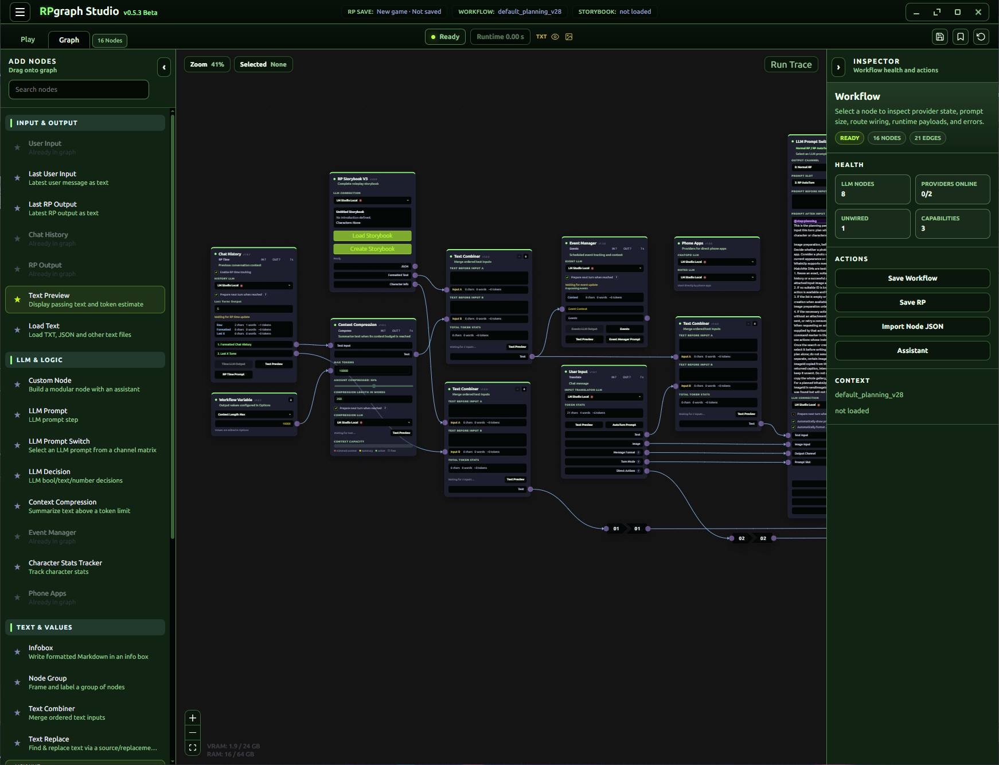
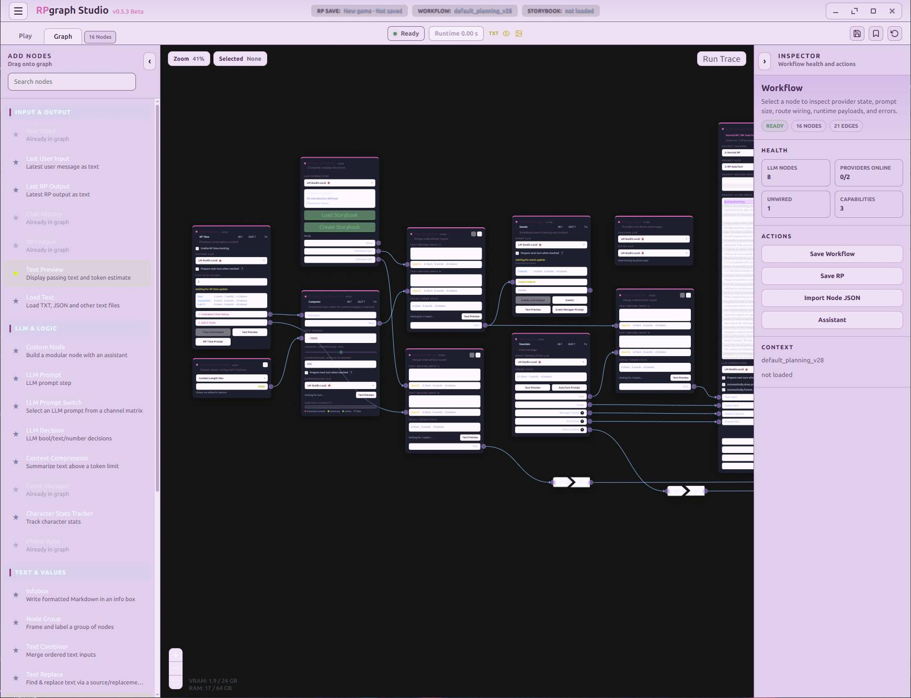
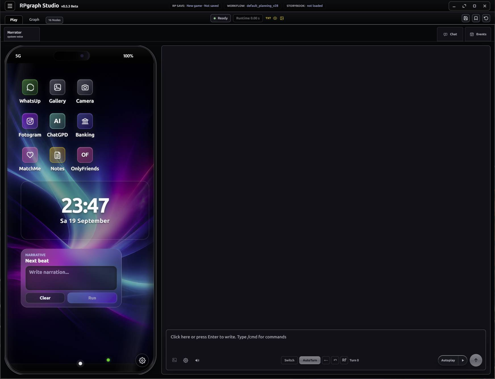
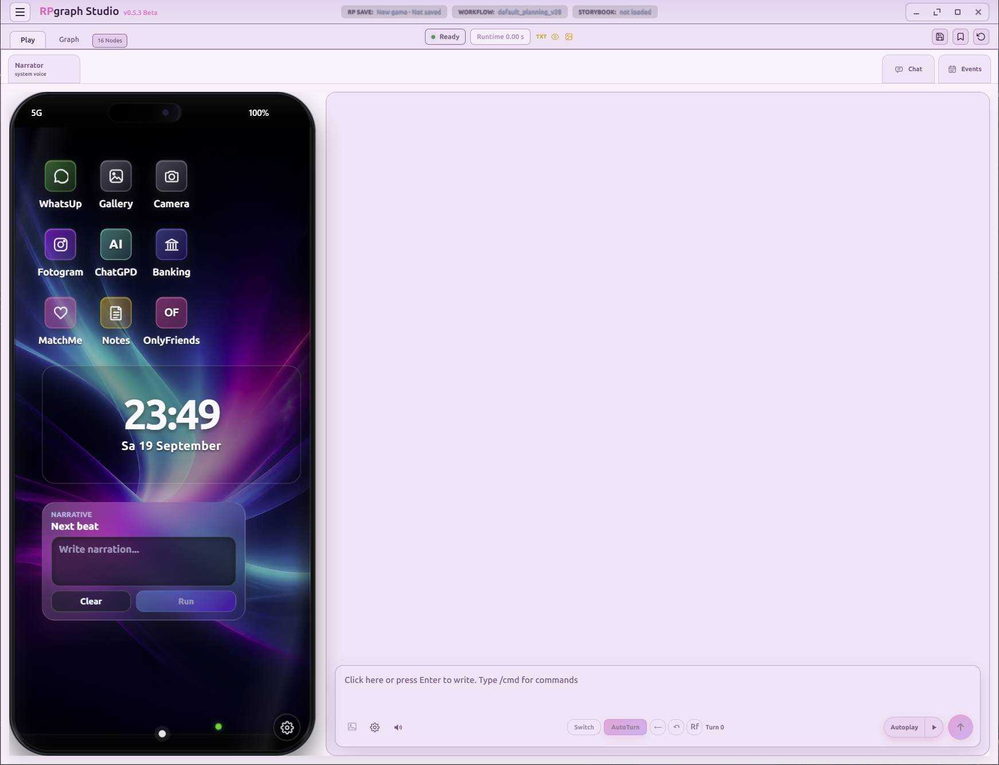

# Sloppified Fork of RPGraph Studio

## What This Fork Changes

This fork is based on RPGraph Studio **v0.5.3**. The list below describes the additions
and design changes maintained by this fork on top of that upstream release.

*Authors note: Written by a confused AI Agent, might be redundant or straight up a lie.

## Interface and Theme Showcase

The fork applies its theme system across both the full Graph workspace and the dedicated
Play workspace—not only isolated controls.

### Graph Mode

<p align="center">
  
  
</p>

### Play Mode

<p align="center">
  
  
</p>

[Open the complete eight-image slideshow](https://htmlpreview.github.io/?https://raw.githubusercontent.com/hgdubbe/RPGraph_sloppified/main/fork-showcase/index.html)

### Studio Workspace and Navigation

- Splits graph editing and roleplaying into dedicated **Graph** and **Play** workspace tabs.
- Replaces the graph's hover drawers with a docked node palette and inspector, each with
  its own collapse control and scrollable content.
- Moves the graph toolbar into the title bar, groups related commands, and uses compact
  icons for workflow save, RP save, and reset actions.
- Adds a dedicated Play shell with a resizable panel, character strip, activity rail, and
  direct shortcuts to chat, events, phone surfaces, Gallery, social apps, Banking, and Notes.
- Adds detachable/pop-out workspace support and a larger dedicated text editor for editing
  long node content.
- Moves secondary application commands into the burger menu to leave more space for the
  active graph, roleplay, or Storybook content.

### Storybook and Character Editing

- Rebuilds Storybook editing as a persistent V2-style workbench with **Story**,
  **Characters**, and **Surfaces** navigation instead of stacked modal navigation.
- Adds a dedicated Cast Overview and focused character-detail pages.
- Moves phone accounts, Banking, image generation, and voice setup into the relevant
  character's workbench sections; changes save immediately instead of being buffered in a
  separate Character Setup modal.
- Adds an in-editor contact-visibility matrix and clearer relationship editing.
- Moves character export next to import and simplifies the character identity/image fields.
- Keeps character agency-tag controls visually integrated with the active Studio theme.

### Roleplay and Recovery

- Adds optional rotating turn autosaves and a startup recovery dialog for choosing between
  recent autosaves.
- Adds message context comments so directions such as "obviously sarcastic" can accompany
  the user's visible message without becoming part of that visible dialogue.
- Adds direct activity shortcuts and separates phone/social output commits from the main
  graph-run wiring.
- Makes generated phone images usable from the embedded picker flow and marks newly
  received Gallery images.

### Phone Simulation and Social Apps

- Rebuilds the in-world phone with iPhone-style device chrome, notch/status treatment,
  home screen, portrait and landscape layouts, glass/reflection assets, and selectable
  wallpapers.
- Adds phone widgets and a character mood-status control.
- Gives Notes, ChatGPD, Banking, Gallery, Fotogram/OnlyFriends, and related social surfaces
  dedicated layouts rather than treating them as generic desktop panels.
- Recreates the **OnlyFriends**, **MatchMe**, and **Fotogram** account-registration screens
  with app-specific branding, assets, validation, and controls.
- Improves social-account matching: handle comparison tolerates common LLM punctuation
  slips and avoids false ambiguity when NPCs share names with bundled characters.
- Preserves real character identity alongside app handles across MatchMe, Fotogram, and
  OnlyFriends.

### Theme System

- Adds a manifest-based, app-wide theme engine covering the title bar, Graph workspace,
  Play workspace, Storybook, dialogs, menus, inputs, popovers, inspectors, logs, provider
  screens, Turn Trace, NPC Library, and other Studio chrome.
- Ships **12 selectable themes**: Calm, Classic, Cute Girly, Goth, Hardcore, iPhone Noir,
  Kawaii Dream, Neon Social, Normal Guy, Rainy Window, Studio Night, and Terminal Green.
- Loads user-authored `theme.json` manifests from a per-user theme folder, with reload and
  folder-opening controls in the desktop app.
- Derives shared shell, graph, Storybook, and application colors from semantic tokens so a
  theme changes the whole workspace rather than only replacing a few literal colors.
- Gives Notes, ChatGPD, Banking, Gallery, and Social independent phone-app token namespaces
  and separate CSS modules, allowing each app to keep its own visual identity.
- Adapts upstream Banking additions to semantic theme tokens instead of leaving a fixed
  dark-blue palette in the themed workspace.
- Includes user documentation, theme internals, token extraction tooling, validation tests,
  and a reusable guided theme-designer skill under
  [`resources/themes/`](resources/themes/README.md).

### AI Providers and Media Generation

- Adds explicit **Unsloth**, **Venice AI**, and **Composite** provider integrations, model
  discovery, capability handling, health checks, and desktop IPC adapters.
- Extends LM Studio integration with CLI-based model listing, loading, probing, and unloading.
- Adds Venice speech and image generation support to the existing generation tools.
- Adds bundled **Flux.2 Klein 9B** ComfyUI workflows in normal and API-variable formats.
- Adds configurable ComfyUI generation steps, sampler, scheduler, dimensions, model parts,
  and LoRA slots to connection settings and graph execution.
- Supports embedded image-generation UI inside phone flows as well as the standalone dialog.

### Performance and Runtime Reliability

- Caches derived portrait data URLs so embedded JPEGs are not repeatedly copied and
  base64-encoded during ordinary React updates.
- Caches effective NPC/character registry projections while their source data is unchanged.
- Stabilizes node-action callbacks to reduce context-wide rerenders across visible graph nodes.
- Batches streamed text updates to reduce renderer work during generation.
- Improves provider cleanup and model lifecycle handling when closing the application.
- Fixes the Windows live-reload blank window by making shared agency-tag validation a real
  browser-compatible ES module.
- Improves the Windows launcher and dependency bootstrap, including the expected Node.js
  version and desktop-development paths.

### Maintenance and Compatibility

- Retains the upstream v0.5.3 Banking, bundled-NPC, workflow, social-identity, agency-tag,
  character-contact, and runtime improvements while adapting their changed surfaces to the
  fork's workspace and theme systems.
- Keeps workflow, Storybook, character-card, save, and encrypted-file compatibility with
  the upstream data model.
- Adds focused regression coverage for themes, provider adapters, turn variants, phone and
  social commits, mood state, autosave-related behavior, portrait caching, and renderer
  performance boundaries.

# 🎭 RPgraph Studio

> **Your personal roleplay engine — powered by your own AI, running entirely on your machine.**


🎬 **Demo video:** https://youtu.be/nweut7o-qnA

RPGraph Studio is a **local-first desktop app** for interactive AI roleplay. Instead of a plain chatbox, you get a full studio: a **visual node workflow** decides how your story is built, a rich **RP [...]

No cloud account. No subscription. Your stories stay on **your** computer. 🔒

---

## ✨ Why RPgraph Studio?

- 🧩 **A pipeline, not a mono-prompt.** Each turn is split into **several focused LLM calls**: translation, the actual response, then after-work like speaker marking, story-time tracking, and event [...]
- 🔀 **The right prompt for every moment.** Normal reply, phone text, narrator turn, social post, event — each situation gets its own prompt through the graph, automatically.
- 📱 **A phone full of apps.** Characters text, post, and bank on an in-world phone whose messages appear inline in the story.
- 📖 **Story memory.** Storybooks hold characters, world context, and images — including **SillyTavern character imports** — with a built-in assistant to create and edit them.
- 🎛️ **Mix and match models.** Every LLM node can use its **own connection**: a small local model for simple jobs, a bigger model for the actual roleplay.
- 🏠 **Local & private.** Connects to LM Studio, Ollama, llama.cpp (router mode), OpenRouter, or Google Gemini. Optional ComfyUI connections add image and voice generation. Everything is saved as fi[...]

---

## 🚀 Features

### 🕸️ Visual Node Workflow
- Build your RP pipeline from nodes: user input, LLM prompts, story context, history, routing, output.
- **LLM Prompt Switch** nodes pick the matching prompt variant automatically — normal RP, phone, social media, AutoTurn, narrator, events, Autoplay.
- Live node colors show what's running, finished, prepared, or failed.

### 💬 Roleplay Chat
- Combined timeline where phone and app messages appear **inline** inside the roleplay.
- Character selection, narrator mode, drafts, image attachments, editing & regeneration.
- 🎨 **Spoken text highlighting**: quoted dialogue is colored per character.
- ⏰ **In-world time tracking**: the LLM estimates passed time and timeline labels.
- 🔊 **Voice playback** (optional): cloned character voices and a narrator can read the story aloud.

### 📱 Character Phone
A phone-style UI owned by your characters, with its own apps:
- **WhatsUp** — messenger with contacts, unread badges, replies, images, and voice messages.
- **Fotogram & OnlyFriends** — social media with posts, comments, likes, and DMs.
- **Camera & Gallery** — character photos, uploads, and generated images.
- **Banking** — accounts, balances, statements, and transfers.
- **Notes** — editable character note cards.

### 📅 Events
- Schedule story events that can be **triggered, cancelled, or skipped** — and run straight through your workflow.

### 🌍 Translation Modes
- Translate only your input to English, **or** run the whole RP internally in English and translate the output back to your display language.

### 🤖 Built-in Assistant
- Press **`F1`** for help with your workflow — or select a node and press `F1` to ask about *that node*.
- The assistant can inspect your graph, node states, and recent runs to help you debug.

### 🖼️ Image & Voice Generation (optional)
- Connect **ComfyUI** to generate character images and voice clips right from the workflow.
- RPGraph swaps between your LLM and the ComfyUI image/voice models **automatically** within seconds — one GPU is enough.

### 💾 Saves & Files
- **RP Saves** bundle everything: workflow, storybook, and full chat history — pick up exactly where you left off.
- Reusable **workflow files**, standalone **storybooks**, and exportable **character cards**.
- Save as plain JSON or as a **password/PIN-encrypted** file. 🔐

---

## 🏁 Getting Started

> 🧠 **Which model do I need?** Recommended: **[gemma-4-31B-it-uncensored-heretic-GGUF](https://huggingface.co/llmfan46/gemma-4-31B-it-uncensored-heretic-GGUF)**. RPGraph was built and tuned around [...]

Install **[Git](https://git-scm.com/download/win)** and **[Node.js 24](https://nodejs.org/)**, then download RPGraph Studio:

```bash
git clone https://github.com/unrefined803/RPGraph.git
cd RPGraph
```

Launch the app:
- Linux: `RPGraph-linux.sh`
- Windows: `RPGraph-windows.bat`

If packages are missing, the starter will offer to install them.

---

## 📜 License

RPGraph Studio is free software, licensed under the **GNU AGPL v3.0 or later**. See [LICENSE](LICENSE).

---

## 🧪 Beta Notice

RPGraph Studio (v0.5.4 Beta) is a hobby project built with AI assistance. I am not a professional developer — bugs are expected, feedback is welcome! 💙
