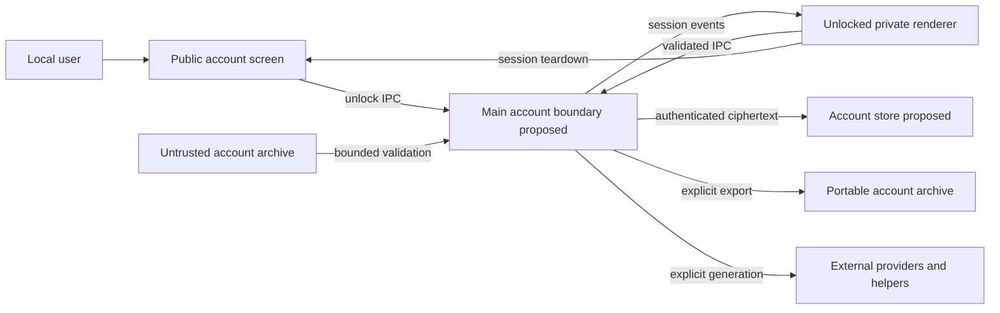

# Local-account pre-implementation security audit

Historical pre-implementation baseline. Account implementation and scoped post-review are now documented in [post-implementation-audit.md](post-implementation-audit.md); the original findings and line references below are retained rather than rewritten as current-code claims.

## Executive summary

The current single-user architecture is not a security boundary between profiles. The highest-risk migration gaps are global filesystem and browser stores, renderer-controlled save protection, eager private-library initialization, and asynchronous work that can outlive an account switch. Existing authenticated encryption is a useful foundation, but wrapping the current application in a login dialog would not provide the requested confidentiality. This source review identifies blockers for the proposed feature, not demonstrated remote exploits or evidence that private content was uploaded. Account implementation and the independent post-implementation audit are still outstanding.

## Scope and assumptions

- Baseline: `1055a6fbf5b09001f328274cdc7c214177125302` plus existing uncommitted startup/autosave/theme/scroll fixes, inspected 2026-09-27. Evidence paths and one-based lines refer to this working tree. No private AppData content was required for this account-design review.
- In scope: Electron main/preload, React startup and state, settings, file/storage adapters, account crypto/archive design, libraries/themes/assets, browser caches, external-provider boundaries, migration and diagnostics.
- Confirmed by user: local accounts, protecting data at rest and logged-out profiles; not online accounts or protection against malware/admin access. RPGraph-specific archive encryption and decryption tool are acceptable.
- Required default credentials are publicly known and must not act as a master password. Passwordless accounts provide organization and consent gating, not confidentiality.
- Minimal public account alias/authentication metadata and ciphertext sizes/counts are disclosed limitations. Provider-owned caches and existing external originals are outside account storage protection.
- Out of scope: a cloud service, remote session authentication, OS/kernel security, forensic memory erasure, provider-side retention control, hiding filesystem access patterns, full dependency/supply-chain audit. CI/build are reviewed here only for not publishing private fixtures/artifacts; this is not a complete CI security audit.
- Open implementation questions: exact bounded archive sizes/chunk sizes and target-device KDF latency require measurement; actual cross-platform Chromium cache/crash behavior requires packaged-app verification. None permits a plaintext fallback or changes the confirmed local-account scope.

## System model

### Primary components

Current runtime is an Electron desktop application with a TypeScript/React renderer, CommonJS main process, preload IPC bridge, JSON/file libraries, browser preference storage, and model/image/voice integrations. Main-process paths and persistence are application-global (`electron/main.cjs:327`, `:428`, `:432`); settings serialization and API-key protection live at `:370` and `:5827`. Private library/theme construction occurs at `:227`–`:273` and NPC initialization at `:6294`. The BrowserWindow configuration at `:6207` includes isolation-related controls but does not itself provide account authorization.

Proposed components are a main-owned AccountManager/AccountStore, a versioned crypto/archive boundary, and ephemeral unlocked renderer sessions. They are specifications in [the plan](plan.md), not existing controls.

### Data flows and trust boundaries

- User → renderer: passwords, settings, content and selected files through UI. The new login must clear password component state after IPC and avoid mounting private content before unlock. Current localStorage call sites include `src/App.tsx:653` and `src/app/useRoleplayPanelRuntime.ts:220`.
- Renderer → main process: IPC requests and asynchronous events via `electron/preload.cjs:182`, `:220`. Existing file capabilities restrict selected paths (`electron/main.cjs:293`); new account authorization, sender validation, schema validation and epoch checks must be enforced in main, not by disabled UI controls. Encryption flags supplied by renderer are not authorization.
- Main → disk: JSON/settings, libraries, encrypted file envelopes and atomic replacement. Existing scrypt/AES-GCM (`electron/main.cjs:1104`, `:1141`) and atomic-write helper (`:645`) protect selected operations, not the entire account. Proposed AccountStore encrypts all private records/catalogs before disk and validates path containment.
- Main/renderer → provider/helper: prompts, credentials and image/voice content via network/IPC/subprocesses. Existing provider uploads can create copies outside app storage (`electron/main.cjs:3483`, `:3535`, `:5535`). Vault encryption cannot secure those copies or retract sent requests.
- User-supplied file/archive → parser/store: current generic read/write surfaces (`electron/main.cjs:5593`, `:5685`); proposed account ZIP importer adds a new untrusted parsing boundary requiring bounds, path normalization, authentication and transactional publication.
- A session → later B session: global capabilities, queued writes and streams (`electron/main.cjs:129`, `:5853`, `:4720`) currently have no account epoch. Proposed lifecycle must isolate writes, events, media, diagnostics and renderer storage across the transition.
- Development/CI → upstream: source, public assets and synthetic fixtures only. Runtime data must stay outside repository and release/test artifacts. No private account corpus is needed for automated security tests.

#### Diagram

## Assets and security objectives

| Asset | Why it matters | Security objective (C/I/A) |
| --- | --- | --- |
| RP content, stories, graphs, images/audio, characters | Highly personal creative content; must not cross accounts or appear before consent | C/I/A |
| Settings, prompts, endpoints, API keys, private themes | Reveal behavior and credentials even without story text | C/I |
| Account DEK, password wrapper and session authority | Protect all account content; exposure defeats the vault | C/I |
| Catalog, recovery state, autosaves and archives | Must remain consistent and recoverable after crashes and imports | I/A, C for private metadata |
| Public account index | Intentional minimal disclosure; no private content migration into it | I/A; minimize C exposure |
| Repository and release artifacts | Must contain no private fixtures, account exports or credentials | C/I |

## Attacker model

### Capabilities

A casual co-user can launch the application, know the default password, create/select a passwordless account, inspect publicly exposed UI, or obtain a copy of stored files/exports. A malicious archive author can supply bytes and filenames for an import the user chooses. A malicious renderer would be able to call exposed IPC; account authorization must not rely on the renderer choosing honest account IDs. Background callbacks can also cause accidental cross-account disclosure without a malicious actor. Offline ciphertext holders can attempt password guesses.

### Non-capabilities

We do not claim to protect against an administrator, debugger, malware, a modified application, OS memory inspection, a screen observer during unlocked use, or a malicious provider retaining submitted content. There is no new internet-facing login server. A compromised unlocked renderer can observe rendered plaintext; IPC hardening limits access but does not make that renderer confidential. Do not rank an unsupported remote pre-auth attack as proven.

## Entry points and attack surfaces

| Surface | How reached | Trust boundary | Notes | Evidence (repo path / symbol) |
| --- | --- | --- | --- | --- |
| Settings/library/file IPC | Preload methods | Renderer → main → disk | Global roots; account checks required | `electron/main.cjs:5406`, `:5827`, `:6092`; `electron/preload.cjs:182` |
| Protection selection | Renderer save-policy call | Renderer → crypto policy | Must become main-derived | `electron/workspaceProtection.cjs:4`; `electron/main.cjs:5430` |
| Startup initialization/restore | App startup and recovery | Locked → private data | UI consent and backend access are separate controls | `electron/main.cjs:227`, `:5753`, `:6294`; `src/app/useRpgraphFiles.ts` |
| Browser preferences/cache | Hooks and Chromium session | Renderer → persistent storage | Account-key prefixes do not encrypt | `src/App.tsx:653`; `src/components/ModelIdPicker.tsx:17`; `electron/main.cjs:6207` |
| Streaming/queued saves/dialog paths | Provider and async callbacks | A session → B session | Globals and stale capabilities | `electron/main.cjs:129`, `:4720`, `:5853` |
| Generic export/download | Save actions | Unlocked data → external file | May bypass new account policy | `electron/main.cjs:5685`; `src/components/TurnTraceDialog.tsx:320` |
| Legacy encrypted envelopes | File load/decrypt | Untrusted bytes → crypto/parser | Retain compatible readers, restrict new account format | `electron/main.cjs:1104`, `:1157`, `:1268` |
| Account ZIP import | Proposed login import | Untrusted archive → store | New surface, no current account importer claim | [archive specification](plan.md#5-export-import-and-decryption-tool) |
| Provider/helper files | Generation, voice, face helpers | Account → third party/temp | Explicit residual-risk disclosure | `electron/main.cjs:3483`, `:3535`, `:5535` |

## Top abuse paths

1. Co-user enters default → calls a global library/settings handler → receives another account's content because the login was only a renderer overlay.
2. Disk reader opens browser preferences/settings or an eager private-library cache → obtains private settings, aliases or content despite encrypted RP save files.
3. A begins generation/autosave → switches to B → a delayed callback uses current globals → A's content is saved in or displayed to B.
4. Protected account uses an old generic JSON export/download → plaintext content lands in a normal directory without a clear downgrade decision.
5. Archive author supplies traversal/colliding paths or a decompression bomb → importer overwrites outside the destination or exhausts memory/disk before authentication.
6. Ciphertext holder swaps account/object envelopes or supplies extreme KDF parameters → weak binding enables substitution, or unlock/import consumes unbounded resources.
7. Migration encrypts the new store but leaves old plaintext browser/filesystem copies → UI falsely states everything is protected.
8. User generates private media → provider writes a plaintext input/output copy → user incorrectly assumes account locking encrypts the provider's directory too.

## Threat model table

These priorities measure release risk for the requested account feature. “Current gap” is not a claim that the existing single-user product promised multi-user isolation.

| Threat ID | Threat source | Prerequisites | Threat action | Impact | Impacted assets | Existing controls (evidence) | Gaps | Recommended mitigations | Detection ideas | Likelihood | Impact severity | Priority |
| --- | --- | --- | --- | --- | --- | --- | --- | --- | --- | --- | --- | --- |
| TM-001 | Co-user or forged renderer call | Login added without main-process ownership | Read/write another profile through global roots or renderer-chosen policy | Cross-account disclosure/modification | All content, keys/settings | Selected-path restrictions `main.cjs:293`; context isolation `:6215` | No account authorization; renderer policy `:5430` | Default-deny IPC, validated sender/args, main-owned account and key, rooted store; fixed default is not master | Synthetic locked/forged-ID tests; metadata-only denied-operation counters | High: existing global design makes a superficial login insufficient | High: complete account confidentiality loss | high |
| TM-002 | Local disk reader or startup UI | Protected content stored in mixed plaintext paths | Read preferences/private theme/library before unlock | Private content/settings exposure | Settings, libraries, metadata | API-key protection `main.cjs:370`; some encrypted files | Settings fallback, localStorage, eager library init `:227`, `:6294` | Full persistence inventory/adapters, encrypted index, ephemeral renderer, bundled login resources | Canary scans after save/lock/restart; assert no preunlock private reads | High: several concrete persistence paths | High: defeats all-data requirement | high |
| TM-003 | Race or late callback | A has outstanding work during switch | Complete write/event under B or reuse A path capability | Cross-account write/display | Content, credentials, capabilities | Stream cancellation helper `main.cjs:2273` | Globals/queues lack epoch `:129`, `:5853` | Capture account+epoch at start/commit; cancel/drain; revoke URLs/capabilities; destroy private renderer | Stalled stream/dialog/debounce integration tests | High: normal async operation creates races | High: private content enters another profile | high |
| TM-004 | Accidental export path or manipulated policy | Protected account uses legacy save/download | Emit plaintext without explicit downgrade | External plaintext disclosure | Exports, diagnostics, media | Existing encrypted save helpers `main.cjs:1129` | Generic writer `:5685`; browser downloads | Route every export through account policy; encrypted whole-account backup; explicit separate plaintext disclosure workflow | Scan output bytes using synthetic markers; cover every export action | High: real alternative output paths exist | High: all exported content may escape | high |
| TM-005 | Malicious archive author | User imports a supplied archive | Traversal, links, collision, oversized/deep payload or ZIP bomb | Overwrite or availability loss | Filesystem, account integrity | Existing selected-path capabilities; no account importer yet | New parser surface not implemented | Quarantine, allowlisted schema, normalized paths, resource bounds, no generic extraction, authenticate before publish | Hostile-archive corpus, cancellation/disk budget tests | Medium: requires chosen malicious import | High: arbitrary write if mishandled; otherwise denial of service | high |
| TM-006 | Offline ciphertext attacker | Access to stored objects or archive | Guess weak password, swap objects/header, force expensive KDF | Key recovery, substitution or resource exhaustion | Keys and content | AES-GCM and scrypt `main.cjs:1104`, `:1141` | Old metadata visible `:1157`, `:1268`; static AAD `:125`; existing scrypt cost below chosen new profile | Versioned DEK wrapping, allowlisted bounded KDF, account/object/type AAD, encrypted metadata; strong-password advice | Golden vectors, tamper/swap/KDF-limit tests | Medium: ciphertext access plausible, recovery depends on password | High for key recovery; medium for metadata/DoS | high |
| TM-007 | Crash, disk-full or incomplete migration | Conversion, import, rewrap or rotation interrupted | Publish inconsistent root or leave plaintext generations | Data loss or false protection | Entire account and recovery data | Atomic rename helper `main.cjs:645` | No account-wide transaction/migration yet | Immutable encrypted staging, durable catalog commit, verified migration, explicit residual-original cleanup | Fault injection at every commit boundary; report incomplete protection | Medium: failures are ordinary operational risks | High: irreversible content loss or plaintext leftovers | high |
| TM-008 | External provider or leftover file owner | Explicit generation/export/migration happened | Retain copies outside account store | Privacy expectations exceeded | Provider content, external originals | User-selected provider/file workflows `main.cjs:3483`, `:3535` | Vault cannot control other processes or old copies | Explain limits, copy owned assets, inventory leftovers, explicit cleanup only; no automatic network on import/login | Synthetic provider temp tests; user-visible residual-copy report | High for retained provider/legacy copies | Medium within stated local-store scope; sensitive content can still be exposed | medium |

### Pre-implementation audit outcome

Seven concrete blocker categories were independently identified: global data authorization (TM-001), renderer-selected protection (TM-001), plaintext settings/browser stores (TM-002), eager private initialization (TM-002), global queues/capabilities (TM-003), revealing/unbound metadata (TM-006), and generic plaintext exports (TM-004). Archive and transaction threats add design requirements for new code. None is closed merely by this plan.

Existing controls worth preserving: authenticated encryption and random nonces; bounded current scrypt execution; selected-path capabilities; atomic single-file replacement; BrowserWindow isolation/navigation restrictions; streaming cancellation. Verify their integration rather than replacing them wholesale. [Electron's security guidance](https://www.electronjs.org/docs/latest/tutorial/security) supports keeping sender validation and process isolation at the IPC boundary; neither substitutes for per-account authorization.

## Criticality calibration

- **Critical:** reproducible compromise of every protected account without its password, such as a universal default/master-key bypass; or arbitrary privileged code execution from a routine unauthenticated archive preview. Neither is demonstrated by this review.
- **High:** another local profile can read private content; an ordinary protected save creates plaintext without consent; migration destroys the only usable account. These directly violate the central product guarantee.
- **Medium:** private metadata exposure with content still encrypted; bounded application denial of service from a chosen import; confusing disclosure about provider-owned residual copies within the stated boundary.
- **Low:** nonprivate version information visible while locked; a cosmetic lock-screen defect with no private flash; redundant sanitized error messages. Cosmetic does not include visible story titles or image previews.

Likelihood assumes normal local use with sensitive stories and occasional imports, not a publicly exposed multi-tenant service. A broader remote-access model would require a new threat model, not relabeling this one.

## Focus paths for security review

| Path | Why it matters | Related Threat IDs |
| --- | --- | --- |
| `electron/main.cjs` | Global persistence, startup, IPC, capabilities, streams, crypto and BrowserWindow lifecycle | TM-001–008 |
| `electron/preload.cjs`, `src/electron.d.ts` | Exposed authority, sender/session contract and public locked-state allowlist | TM-001,003,004 |
| `electron/encryptionFormat.cjs`, `electron/workspaceProtection.cjs` | Legacy format compatibility and removal of renderer authority over account protection | TM-001,006 |
| `electron/npcLibrary.cjs`, `electron/themeLibrary.cjs`, `electron/phoneHomeThemeLibrary.cjs` | Eager private libraries, asset persistence and public/private split | TM-002 |
| `src/App.tsx`, `src/settings.ts`, `src/app/useRpgraphFiles.ts` | Private state initialization, settings and restore consent | TM-002,003,007 |
| `src/app/useRoleplayPanelRuntime.ts`, `src/chat/useAutoplay.ts`, `src/app/useNodePalette.ts` | Browser preferences and running jobs across account switches | TM-002,003 |
| `src/components/ChatConversationPanel.tsx`, `src/components/ModelIdPicker.tsx` | Additional browser persistence and old-account UI state | TM-002,003 |
| `src/components/TurnTraceDialog.tsx`, `src/components/UiPerformanceDiagnostics.tsx` | Sensitive logs/buffers and export bypasses | TM-002,004 |
| `src/graph/comfyImageRunner.ts`, `scripts/character-faces.mjs` | Media/helper copies and external processing limits | TM-002,008 |
| `src/browserRpgraphStub.ts` | Avoid claiming desktop account protection in a nonpersistent browser stub | TM-001,002 |
| `src/dialogs/StudioDialogs.tsx`, `src/components/TurnAutosaveChoiceDialog.tsx` | Visible account/autosave policy and themed recovery consent | TM-002,004 |
| Proposed account store/archive/crypto modules | Transactions, keys, parsing and validation must receive independent review | TM-001,005,006,007 |

## Notes on use

This is a source-based pre-implementation review supported by independent storage and security agents; it is not a penetration-test certificate, a full historical repository privacy audit, or proof of runtime behavior. Account modules have since been added but are not yet integrated with the application; this review must not be mistaken for their post-implementation audit. No private data was used as test material.

Quality check: identified IPC, startup, browser persistence, file import/export, async session and provider/helper entry points are covered; every listed boundary has corresponding threats; runtime is distinguished from CI/publication; user-confirmed local-account/archive scope is reflected; remaining measurements and residual risks are explicit.

Post-implementation review must be performed against the final diff and packaged app, preferably by an agent/reviewer who did not write the reviewed code. Require evidence for each threat: relevant code, focused automated tests, manual startup/lock/switch/restore checks, encrypted export/import/decryption roundtrip, hostile archive tests, filesystem canary scans, and crash/disk-full tests. Record tested OS/runtime versions and exact failures, not just “security audit passed.” Unresolved high-priority account confidentiality/integrity findings block release. Revisit this model when remote accounts, browser persistence, recovery keys, sync, or plugins gain access to the vault.
