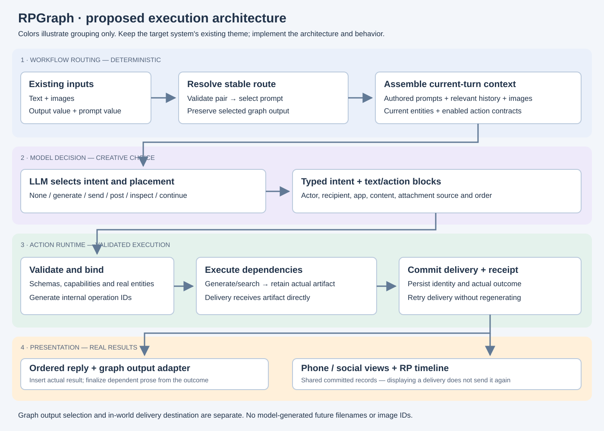
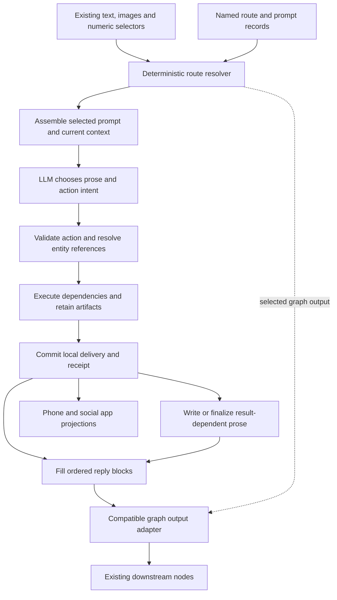
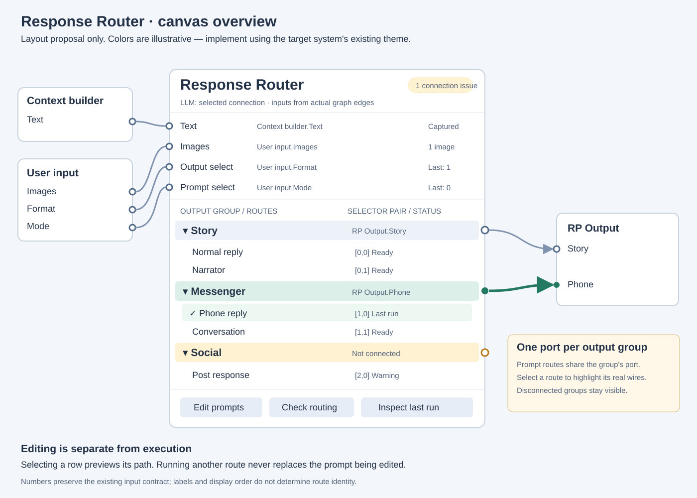
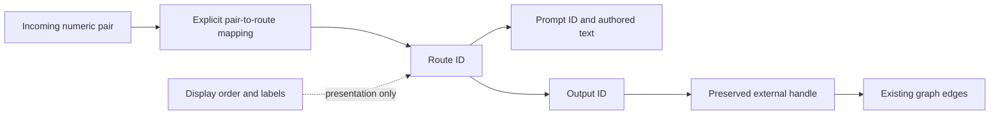
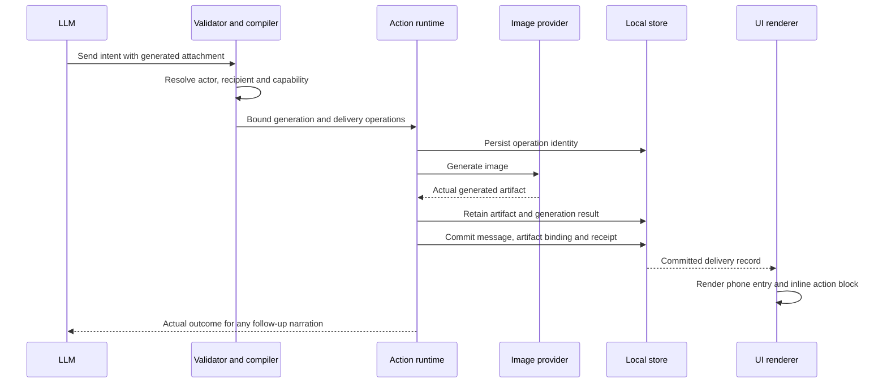
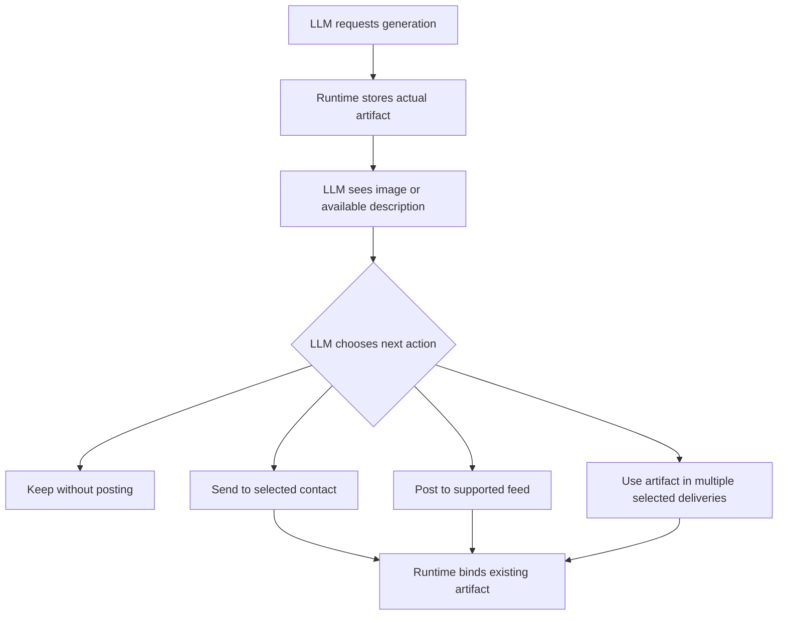
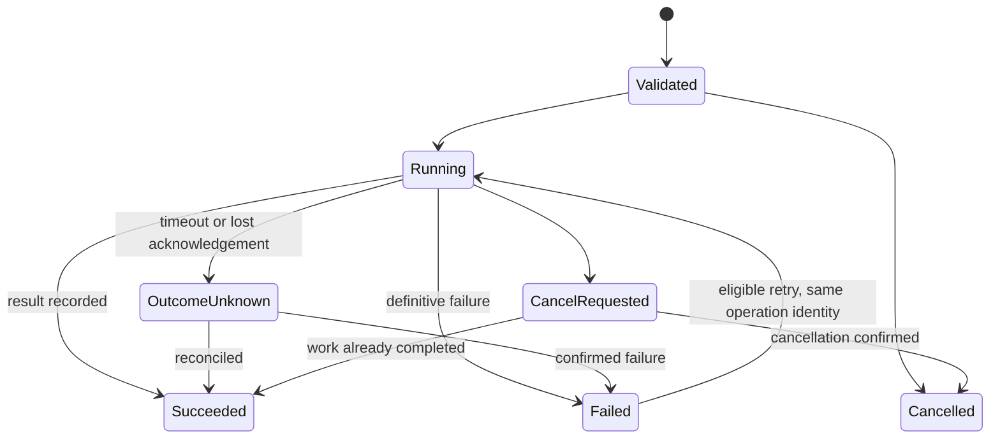
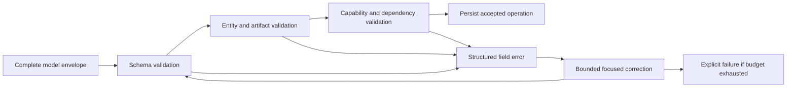

# RPGraph redesign — illustrated implementation handoff

This document expands the two proposals into layouts, interaction rules, data flows and worked examples. It is a design specification, not a screenshot of implemented software. All example route labels, selectors, characters and identifiers are illustrative. The evidence and reviewed revision are recorded in [HANDOFF.md](HANDOFF.md).

**Theme requirement from the user:** the target system uses a different color theme. All colors in these graphics are illustrative only. Use the target system's existing theme, design tokens and established node/edge/status styles. Do not reproduce this palette or recolor the application to match it. Evaluate layout, information hierarchy, route visibility and behavior—not matching colors. Status must remain understandable through text and icons independently of color.

Read alongside [Prompt Switch redesign](prompt-switch-redesign.md) and [command pipeline proposal](command-pipeline-proposal.md). Where this document adds a concrete recommendation, treat it as a proposed default to check against current source, not as already-existing behavior.

## 1. The complete design at a glance



There are two separate forms of routing. **Workflow routing** selects which prompt runs and which existing graph output receives its result. It is determined by the numeric inputs, not by the LLM. **Action destination selection** decides where an in-world message, image or post belongs. That remains an LLM decision. They must not be collapsed into the same field: a story-format response may contain a WhatsUp delivery rendered inline in the RP timeline.



The LLM has substantial creative freedom inside a short contract. Code supplies stable identity, checks references, executes work, and integrates the actual outcome. Clear separation prevents a routing UI improvement from accidentally changing which character receives a message.

## 2. Canvas layout: route overview first



The main card answers four questions without opening an editor: what data enters, which routes exist, where they lead, and which route most recently ran. Use an approximately 560–640 px wide card at normal graph scale as an initial layout target; validate this against the existing canvas and typical window sizes. Height is driven by route content rather than large textareas.

### A. Header and incoming data

The header contains the user-editable node label, model connection label, and a validation summary. Below it, each existing input has a left-edge handle, source-node/port label, and a value/status preview.

- For text, show a compact excerpt or character count with “Inspect input”.
- For images, show the connected-image count; reference images from history are identified separately in the inspector.
- For selectors, show the exact raw last value and the resolved integer if conversion is relevant in legacy mode.
- Before any execution, show “Not run yet”; do not fill in zero and imply it was observed.
- When a source is disconnected, show “Not connected” rather than an empty-looking value.

Source labels come from actual incoming graph edges. They are not user-authored routing descriptions that can go stale. Renaming a connected node updates the displayed label through its stable node ID.

### B. Output groups and their routes

Each output group has a title, route count, connection status and one right-edge graph handle. Below it are its prompt routes. A route row contains its name, exact selector-pair badge, validation indicator and recent execution state.

The visible relationship is:

```text
Input pair      Route                 Prompt                  Output group
(1,0)  ───────► Phone reply   ───────► Messenger reply   ─────► Messenger
(1,1)  ───────► Conversation  ───────► Short exchange    ─────► Messenger
                                                                   │
                                                                   └──► RP Output.Phone
```

There is no new graph port for each prompt. A route row selects a prompt that feeds its group's existing port. This is essential to retaining the current external contract.

Expanded groups show all their routes. Collapsed groups show count, errors and the name of the last active route. The active group can receive a badge without automatically expanding and moving handles while a user is wiring. Expansion is a deliberate layout action; update graph handle geometry after it.

At distant zoom, show the node title and output group summaries. At normal zoom, show route names and selectors. A full “All routes” inspector supports a searchable table for the current maximum-size configurations. Search should dim unmatched canvas content or filter the inspector; it must not silently reassign handle positions.

### C. Real connection visualization

Selecting a route emphasizes its output group's outgoing edges and destination ports. Selection must not execute the route or alter numeric inputs. Clicking a destination focuses its node. If the output has three destinations, show a count and an expandable list of all three; do not incorrectly present fan-out as three different action deliveries.

Unconnected groups remain visible with an open-circle handle and a “Not connected” label. Offer “Connect output” and “Mark intentionally unused”. A selected unused/disconnected output still follows the configured execution policy; the label is not permission to silently discard an expected result.

Use text and shape in addition to color. Proposed states:

| State | Row treatment | Edge treatment |
|---|---|---|
| Editing | Pencil icon and “Editing” | No execution emphasis |
| Preview selection | Outline and “Preview” | Dashed or lightly emphasized path |
| Running | Spinner and “Running” | Solid active emphasis |
| Last successful run | Checkmark and timestamp/run number | Quiet persistent selection indicator |
| Invalid configuration | Error icon and specific message | No invented successful path |
| Runtime failure | Failed-stage badge | Preserve the attempted path for diagnosis |

Hover is optional convenience. Keyboard focus, Enter/Space selection and a textual destination list provide equivalent information. Avoid infinite animation after a completed run.

## 3. Prompt editor: one route with its full context

```text
┌─ RESPONSE ROUTER / EDIT PROMPTS ──────────────────────────────────────────────┐
│ Search routes…              │ Messenger / Phone reply                         │
│                             │                                                 │
│ STORY                       │ Selected when: Output 1 + Prompt 0              │
│   Normal reply              │ Output: Messenger → RP Output.Phone             │
│   Narrator                  │ Model: inherit node connection                  │
│ MESSENGER                   │                                                 │
│ ● Phone reply               │ PROMPT                                          │
│   Conversation              │ ┌ Before input ──────────────────────────────┐  │
│ SOCIAL                      │ │ Exact authored instructions…               │  │
│   Post response             │ └────────────────────────────────────────────┘  │
│                             │ ┌ Input position · read-only preview ────────┐  │
│                             │ │ Text from Context builder · Images: 1      │  │
│                             │ └────────────────────────────────────────────┘  │
│                             │ ┌ After input ───────────────────────────────┐  │
│                             │ │ Exact authored instructions…               │  │
│                             │ └────────────────────────────────────────────┘  │
│                             │                                                 │
│                             │ ▸ Actions and commands · 3 available            │
│                             │ ▸ Steps and assembled prompt                    │
│                             │ ▸ Advanced / compatibility                      │
│                             │                                                 │
│                             │ [Check] [Preview assembly] [Apply changes]      │
└───────────────────────────────────────────────────────────────────────────────┘
```

This is an editor layout, not a second graph or a replacement for the existing inputs. Preserve the two authored text segments and their position around the input. Do not recast them as system/user roles during migration: that could materially change the model's behavior.

Use an explicit draft and Apply operation as the recommended editing model. Changing route selection preserves drafts by stable route ID; closing with a draft retains it or offers a clear discard choice. The implementation should align this with the app's established editing conventions, but never silently lose a draft. Applying a prompt change is reversible via undo.

Execution reads a frozen configuration revision at run start. If the user applies edits while a call is in progress, they affect the next run. The run inspector names the revision used. The editor does not jump to another route when execution updates `lastRunRouteId`.

“Follow running route” is optional and off by default. Suspend it when a draft is dirty. A banner can offer “Inspect the running route” without replacing the current editor.

### Actions, shared templates and prompt steps

Actions are shown as named capabilities with enabled/available status and a short explanation of any missing dependency. The user can still edit their creative instructions. Stable action bindings belong to configuration, rather than being identified only by display text.

For shared templates show “Used by 4 routes” and list those routes. Offer separate “Edit shared template” and “Make a copy for this route” actions. An edit to one route must not implicitly rewrite every similarly named token across the library.

Existing custom raw tokens remain readable during migration. Recognized tokens may be displayed as chips, but unsupported custom syntax must remain intact. A structured editor must not silently discard syntax it cannot represent.

For multi-pass prompts, show a read-only step outline initially:

```text
Planning → Main reply → configured after-reply work
   └──────── result reference ────────┘
```

The actual outline comes from the parsed prompt, not an assumed universal three-stage pipeline. Selecting a step shows its exact before/input/after composition and prior-output references. Validate references to absent or later steps before a provider call.

## 4. Routing checks, editing and deletion examples

The “Check routing” panel contains two input fields, a source selector (“Manual values” or “Last captured run”), and an explanation. It never invokes upstream graph nodes, the model, or actions.

```text
Output value: [1]    Prompt value: [0]    [Check]

✓ Matches Phone reply
  Prompt: Messenger reply
  Sends output through: Messenger
  Connected destination: RP Output.Phone
  Policy: exact match
```

For an error:

```text
Output value: [1]    Prompt value: [4]

No route matches (1,4).
Messenger accepts prompt values 0 and 1.
[Add a route for (1,4)] [Inspect selector source]
```

These are configuration controls, not a request to have the LLM guess the right route. Fallbacks are explicit configuration. A default for an existing output group handles only a missing prompt match; an invalid output channel is a separate error/policy.

**Deletion example:** deleting route `(1,0)` leaves `(1,1)` unchanged. The old `(1,0)` becomes unmapped. Show affected mappings and any shared prompt usage before deletion. Do not auto-reuse that value for the next newly created route. Deleting an output additionally shows its outgoing edges and routes as the impacted set; remove only the intended objects in one undoable operation.

## 5. Stable data and backward compatibility



Store presentation order independently from numeric matches. Retain the output-channel handle strings on imported nodes even after internal IDs are introduced. New outputs receive stable handles whose identity is not tied to current list position; update any core code that assumes positional handles before enabling this for new nodes.

On import, convert each existing matrix entry into a route and prompt record without deduplicating text merely because it happens to be equal. Copy current action/command semantics and settings. If the current loader supplies defaults for malformed matrices, document and test which effective configuration the migration uses; preserve the original save as the recovery source.

Use a versioned compatibility flag for existing selector coercion. Show the exact legacy behavior in the migration report, including clamping, truncation and default selection. A strict-mode migration changes invalid-input behavior, so it must be explicit rather than hidden inside a cosmetic UI update.

## 6. Action contracts: what the model chooses and what code supplies

| Concern | LLM responsibility | Runtime responsibility |
|---|---|---|
| Whether to act | Choose none, one or several actions | Never force an action because it is available |
| Action and destination | Select supported type, actor, app and recipient | Validate against current catalogs/capabilities |
| Creative payload | Message text, scene description, caption, exchange | Validate shape and bind content to the selected operation |
| Artifact identity | Select among existing exposed references | Generate storage IDs/paths and resolve result references |
| Order and placement | Order intents/text; choose delivery destination | Compile dependencies and preserve block placement |
| Retry | Optionally respond to a reported semantic failure | Reuse completed work and prevent duplicate local commits |
| Final result | Narrate using actual outcomes | Insert the real committed record and attachment |

A selected graph output does not override an explicitly selected action destination. Keep three identities distinct: route ID, operation ID and artifact ID. A fourth ID, the reply block ID, determines where the result appears in the response.

### Example intent: generate and send

The following is illustrative model-facing JSON; exact schema syntax must be designed for the supported providers:

```json
{
  "type": "messenger.send",
  "app": "whatsup",
  "from": "character_1",
  "to": "character_2",
  "text": "Look what I found!",
  "attachment": {
    "type": "generate_image",
    "owner": "character_1",
    "description": "A photograph of the object discovered on the beach."
  }
}
```

The character handles are from the current turn catalog. After validation, code replaces them with stable character IDs. The model does not choose an operation ID, storage path, future image ID or graph output handle.



If final model text forgets to mention the image, the attachment still exists because its binding is application data. If the generation fails, no message claiming to contain that image is committed unless the LLM separately chooses an allowed text-only alternative. Do not silently remove the attachment and send the same text.

## 7. Artifact choice after inspection

The common composite intent is not the only route. Keep an incremental path for “generate first, then decide”:



The continuation receives a compact outcome and a catalog of available artifact handles, not a long prose instruction to copy filenames. Each selected handle is validated for type, existence, save/branch scope and applicable access rules. Search results work the same way: choose among returned items, not arbitrary invented IDs.

Repeated actions get distinct internal operation IDs even when their types and text match. Do not deduplicate by action name or payload hash. Retries reuse the existing operation; a new deliberate send creates a new one.

## 8. Ordered response blocks and narrative consistency

An illustrative model-facing draft can embed the intent at its desired placement:

```json
{
  "blocks": [
    { "type": "text", "text": "She opens the photo on her phone." },
    {
      "type": "action",
      "intent": {
        "type": "messenger.send",
        "app": "whatsup",
        "from": "character_1",
        "to": "character_2",
        "text": "Look what I found!",
        "attachment": { "type": "stored_image", "ref": "image_1" }
      }
    }
  ]
}
```

Code assigns block and operation IDs. After commit, the action block references a delivery record; it does not contain another LLM-produced attempt to serialize that record. Internally, the delivered text and media are sourced from the same receipt used by the phone app.

```text
MODEL DRAFT                 COMMITTED RESPONSE                 APP VIEW

Text block                  Narration
Action intent     ───────►  WhatsUp card  ──────────────────►  Same message
                            ├ actual message text               record ID
                            └ actual image attachment
Follow-up text              Result-aware narration
```

Placement in the RP timeline is a view of a delivery, not a second delivery. A social post, DM and RP-only image display are distinct operations with different effects, even if all can render an image card.

To handle streaming, separate provisional text from committed facts. Stream independent prose if useful, but do not persist an unvalidated action or final success narration from partial JSON. An action card may show “Generating image…” and then transition to delivered/failed using the same block identity.

When the action outcome matters to later prose, generate that prose after the result or regenerate only the affected segment. Structured output does not guarantee truthful prose; it does make the facts available and prevents procedural omission of the actual attachment.

Translation and speaker marking may change designated text fields. They must not receive write access to IDs, dependencies, action types, destinations or the array order of committed action blocks. Historical text containing a marker is never an executable command.

## 9. Recovery: concrete lifecycle and boundaries

Use separate operation records for generation and delivery. Their lifecycles differ; an image generation success is not proof of a delivery success.



An operation that finishes despite cancellation can retain its generated asset, while the run's cancellation gate prevents unsent dependent deliveries from committing. A previously committed message is not undone by cancellation; an explicit compensating local action or branch policy is needed.

| Scenario | Required behavior |
|---|---|
| Generation succeeds; local delivery fails | Retain artifact, mark delivery failed, retry delivery only. |
| Provider times out after accepting work | Mark outcome unknown; reconcile using provider job identity where supported before retrying. |
| App restarts after delivery commit | Load the persisted receipt and render it; do not resend. |
| Caption enrichment fails | Normally retain valid media delivery; mark enrichment unavailable or retry it independently. |
| Recipient reference is invalid | Reject before generation; request a bounded correction of that field. |
| User regenerates only prose | Preserve committed operations and receipts. |
| User replaces an action | Create a new action revision and apply explicit supersede/compensation semantics. |
| Two identical sends are intentional | Preserve both; each has its own identity. |

Store local delivery effects and their receipt atomically or with a recoverable journal protocol. A React state update plus a separate receipt write is not a durable exactly-once local commit. The actual store choice is open; the implementation plan must establish its crash behavior before claiming recovery guarantees.

## 10. Validation and correction without replaying the whole turn



Use a small configurable correction budget; two attempts is a reasonable initial evaluation setting, not a guarantee of success. Retain fields already validated. A correction cannot introduce an unrelated operation unnoticed: validate its action identity and scope against the original request, or treat it as a fresh decision.

Validate a complete decision batch before executing any of its new effects. Partial validation must not silently run the valid subset while discarding the rest. Independent work may later be parallelized only when dependencies, error handling and commit order are explicit. Keep semantic order in the output even if generation jobs finish out of order.

Capability availability does not force execution. A zero-action response is valid. Long-context evaluation must separately score choosing an appropriate action and mechanically executing a valid action: improving the latter does not prove the former.

## 11. Implementation review checkpoints

### First visual milestone

Capture rendered screenshots of a small route set, all groups collapsed, a disconnected output, fan-out, a running route while another is edited, and a large route set. Verify actual edges match destination labels. Ask a reviewer to identify the selected pair, selected prompt and destination without opening raw configuration.

### Compatibility milestone

For representative saved workflows, enumerate all existing valid selector pairs and compare before/after assembled prompt inputs and output handles. Preserve custom raw text and current fallback behavior in compatibility mode. Test renaming, reordering, deleting and undoing changes while retaining stable identities.

### Action milestone

Use a deterministic fake image provider and local store adapter to test generated artifact binding, message receipt creation, retry and restart boundaries. Then verify the real provider integration separately. Do not use a live generation for every unit test.

### End-to-end milestone

Run one story turn containing a generated WhatsUp attachment. Inspect the selected route, actual generation result, delivery record, inline block and phone app entry. Remove image references from final prose in a test fixture and confirm the attachment is still present. Fail delivery after successful generation and confirm retry does not generate another asset.

The broader proposal contains the complete acceptance list. These checkpoints connect the architecture to visible outcomes and give the next session concrete artifacts to produce.

## 12. Navigation and scope

- [Handoff and repository setup](HANDOFF.md)
- [Response Router proposal and source evidence](prompt-switch-redesign.md)
- [Action runtime proposal and source evidence](command-pipeline-proposal.md)
- [Architecture graphic](action-runtime-architecture.svg)
- [Canvas wireframe graphic](response-router-wireframe.svg)

The SVG graphics are standalone local files; they require no internet connection. Mermaid diagrams remain editable source inside this Markdown file and render in compatible viewers. Text wireframes provide a fallback where Mermaid or SVG previews are unavailable. No application source is changed by this document.
